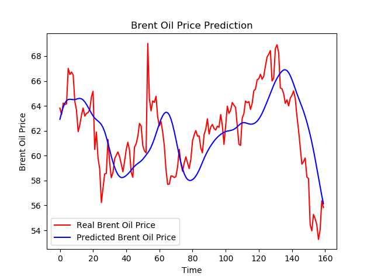

# LSTM_Predict

LSTM使用的是keras所提供的LSTM，而資料前處理則是使用基本的pandas和numpy，同時使用了sklearn的正規化前處理，最後透過matplotlib來視覺化。  

1.  首先建立訓練資料集(15行~33行)，並且正規化，將開盤價(open)限縮在0-1之間
2.  搭建LSTM layer，(40行~55行)，每層LSTM配合dropout = 0.2，來避免過擬和(overfitting)，最後使用兩層不同數目的全連接層來得到預測股價
3.  最後透過測試資料集來比對最後數據是否能預測正確(57行~79行)，並透過視覺化套件來判斷

程式成果: 藍線是預測股價，紅線是正確答案，整體的預測趨勢都會比較晚個幾天，這是因為timestep我設定比較大的緣故，且都會比正確答案晚個幾天，之後或許可以透過調整參數來改善預測成果。  

像是  
* 時間框架長度的調整
* Keras 模型裡全連結層的 activation 與 optimizaer 的調整
* Keras 模型用不同的神經網路（種類、順序、數量）來組合
* batch_size 的調整、epochs 的調整
  

## 參考資料  
`(詳細作法程式跟網站中都有註解)`  
1. https://ithelp.ithome.com.tw/articles/10206312
2. https://www.finlab.tw/%E7%94%A8%E6%B7%B1%E5%BA%A6%E5%AD%B8%E7%BF%92%E5%B9%AB%E4%BD%A0%E8%A7%A3%E6%9E%90K%E7%B7%9A%E5%9C%96%EF%BC%81/
